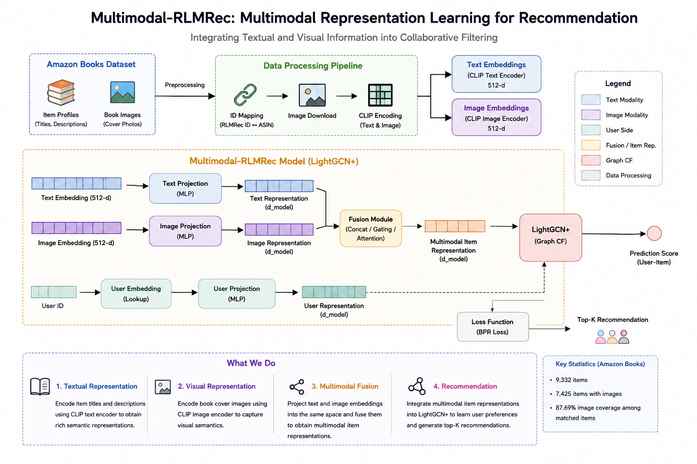

# Multimodal-RLMRec

### Multimodal Representation Learning for Recommendation

An extension of **RLMRec** that incorporates textual and visual item information into collaborative filtering through CLIP-based multimodal representations.

**Final Year Project · Nanyang Technological University**

---

## Overview

Traditional collaborative filtering primarily relies on user-item interaction signals. However, items often contain rich semantic information in the form of text and images.

This project investigates how **multimodal item representations** can be integrated into a collaborative filtering framework to improve recommendation performance.

Building upon **RLMRec**, this project extends the LightGCN-based recommendation pipeline with:

* **CLIP-based text representations**
* **CLIP-based image representations**
* **Modality-specific MLP projection**
* **Multimodal fusion**
* Integration with the **LightGCN+** recommendation framework

### Architecture

<p align="center">
  
</p>

---

## Key Contributions

### 1. Multimodal Item Representation

Instead of relying only on a single semantic representation, the model incorporates both textual and visual information:

```text
Text ──► CLIP Text Encoder ──► Text Projection ──┐
                                                 │
                                                 ▼
                                           Multimodal Fusion
                                                 │
Image ─► CLIP Image Encoder ─► Image Projection ─┘
                                                 │
                                                 ▼
                                      Multimodal Item Representation
```

### 2. Shared Recommendation Space

Text and image embeddings are projected into the same recommendation embedding space using independent MLP projection networks.

User semantic representations are also projected into the same space.

### 3. Integration with Collaborative Filtering

The resulting multimodal item representations are integrated into the LightGCN-based recommendation framework, allowing semantic information to complement collaborative filtering signals.

---

## Dataset

Experiments are conducted on the **Amazon Books** dataset.

### Dataset Statistics

| Statistic                          |  Value |
| ---------------------------------- | -----: |
| Users                              | 11,000 |
| Items                              |  9,332 |
| Items matched with Amazon metadata |  8,467 |
| Items with images                  |  7,425 |
| Image coverage among matched items | 87.69% |

The original RLMRec dataset provides user-item interactions and semantic profiles. Amazon Books metadata is additionally used to obtain book images and associate them with RLMRec item IDs.

---

## Multimodal Data Pipeline

The preprocessing pipeline consists of four main stages:

### 1. Item Mapping

RLMRec item IDs are mapped to Amazon Books metadata and ASINs.

```text
RLMRec Item ID
      │
      ▼
Amazon Metadata
      │
      ▼
ASIN / Image URL
```

The mapping pipeline is implemented in:

```text
scripts/build_image_mapping.py
```

### 2. Image Collection

Book cover images are downloaded from the Amazon metadata.

```text
ASIN / Image URL
      │
      ▼
Book Cover Image
```

Implemented in:

```text
generation/image/download_images.py
```

### 3. CLIP Representation

Both text and image information are encoded using CLIP.

```text
Item Text ───► CLIP Text Encoder ───► 512-d Text Embedding

Book Image ──► CLIP Image Encoder ──► 512-d Image Embedding
```

The encoding scripts are:

```text
generation/text/encode_text.py
generation/image/encode_image.py
```

### 4. Multimodal Projection and Fusion

The generated representations are projected into the recommendation embedding space and fused before being incorporated into the recommendation model.

```text
Text Embedding
      │
      ▼
Text Projection
      │
      ├──────────────┐
      │              │
      │              ▼
      │        Fusion Module
      │              ▲
      │              │
      └──────────────┤
                     │
Image Embedding      │
      │              │
      ▼              │
Image Projection ────┘
                     │
                     ▼
          Multimodal Item Representation
```

---

## Model Architecture

The current implementation extends the `LightGCN_plus` model from RLMRec.

### User Side

```text
User ID
   │
   ▼
User Embedding
   │
   ▼
User Projection (MLP)
   │
   ▼
User Representation
```

### Item Side

```text
                    ┌──► Text Projection ──┐
Text Embedding ─────┘                      │
                                           ▼
                                      FusionMLP
                                           │
Image Embedding ───┐                      ▼
                   └──► Image Projection ─┘
                                           │
                                           ▼
                              Multimodal Item Representation
```

The main implementation can be found in:

```text
encoder/models/general_cf/lightgcn_plus.py
```

Projection and fusion modules are implemented in:

```text
encoder/models/modules/projection.py
encoder/models/modules/fusion.py
```

---

## Repository Structure

```text
Multimodal-RLMRec/
│
├── encoder/
│   ├── config/
│   │   └── ...
│   │
│   ├── models/
│   │   ├── general_cf/
│   │   │   └── lightgcn_plus.py
│   │   │
│   │   └── modules/
│   │       ├── projection.py
│   │       └── fusion.py
│   │
│   └── ...
│
├── generation/
│   ├── image/
│   │   ├── download_images.py
│   │   └── encode_image.py
│   │
│   └── text/
│       └── encode_text.py
│
├── scripts/
│   └── build_image_mapping.py
│
├── tools/
│   └── build_amazon7425.py
│
├── data/
│   └── ...
│
├── iid_to_image.json
├── .gitignore
└── README.md
```

Large datasets, downloaded images, generated embeddings, model checkpoints, and virtual environments are intentionally excluded from the repository.

---

## Getting Started

### Environment

The project was developed and tested with:

* Python 3.9
* PyTorch
* CUDA
* CLIP
* NumPy
* SciPy

A CUDA-enabled GPU is recommended for embedding generation and model training.

### Clone the Repository

```bash
git clone <YOUR_REPOSITORY>
cd Multimodal-RLMRec
```

### Data Preparation

The datasets and large-scale Amazon metadata are not included in this repository.

After obtaining the required data, the multimodal preprocessing pipeline can be executed using the provided scripts.

### Build Image Mapping

```bash
python scripts/build_image_mapping.py
```

### Download Images

```bash
python generation/image/download_images.py
```

### Generate Image Embeddings

```bash
python generation/image/encode_image.py
```

### Generate Text Embeddings

```bash
python generation/text/encode_text.py
```

The generated embeddings are intentionally excluded from GitHub due to their file size.

---

## Experiments

The experimental goal is to investigate whether multimodal item information can complement collaborative filtering representations.

The current comparison framework includes:

| Model              | Text | Image | Multimodal Fusion |
| ------------------ | :--: | :---: | :---------------: |
| LightGCN           |   ✗  |   ✗   |         ✗         |
| RLMRec / LightGCN+ |   ✓  |   ✗   |         ✗         |
| Multimodal-RLMRec  |   ✓  |   ✓   |         ✓         |

Evaluation will focus on standard recommendation metrics such as:

* Recall@K
* NDCG@K

Detailed experimental results will be added as the model development and evaluation are finalized.

---

## Current Progress

### Completed

* [x] Reproduced the RLMRec LightGCN baseline
* [x] Processed the Amazon Books dataset
* [x] Matched RLMRec items with Amazon metadata
* [x] Built item-to-image mappings
* [x] Downloaded book cover images
* [x] Generated CLIP image embeddings
* [x] Generated CLIP text embeddings
* [x] Implemented modality-specific projection networks
* [x] Implemented multimodal fusion
* [x] Integrated multimodal representations into `LightGCN_plus`

### In Progress

* [ ] Improve multimodal fusion strategies
* [ ] Investigate semantic alignment objectives
* [ ] Evaluate different projection architectures
* [ ] Conduct systematic ablation studies
* [ ] Compare multimodal and non-multimodal recommendation models
* [ ] Finalize recommendation experiments

---

## Relationship to RLMRec

This project is based on the original **RLMRec** framework and extends its recommendation pipeline for multimodal representation learning.

The main extensions developed in this project include:

```text
Original RLMRec
      │
      ▼
Semantic Representation
      │
      ▼
LightGCN-based Recommendation


This Project
      │
      ├── CLIP Text Representation
      │
      ├── CLIP Image Representation
      │
      ├── Modality-specific Projection
      │
      └── Multimodal Fusion
               │
               ▼
       LightGCN-based Recommendation
```

The original RLMRec implementation and research framework are developed by the RLMRec authors.

---

## Future Work

The next stage of the project will investigate:

* More expressive multimodal fusion mechanisms
* Semantic alignment between multimodal and collaborative representations
* Contrastive or distribution-level alignment objectives
* Ablation studies for different modalities
* Evaluation of the impact of visual information on recommendation quality

---

## Acknowledgements

This project is based on:

**RLMRec: Representation Learning with Large Language Models for Recommendation**

The original implementation is provided by the RLMRec authors.

This repository contains modifications and extensions developed as part of a Final Year Project at Nanyang Technological University.

---

## Author

**Shu Xuanyu**

Final Year Project
Nanyang Technological University

**Research Interests:**
Recommender Systems · Multimodal Learning · Large Language Models · Computer Vision · Machine Learning
